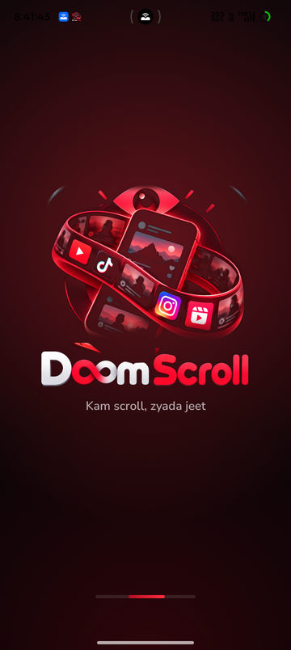
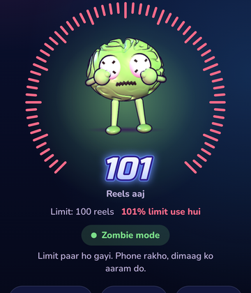
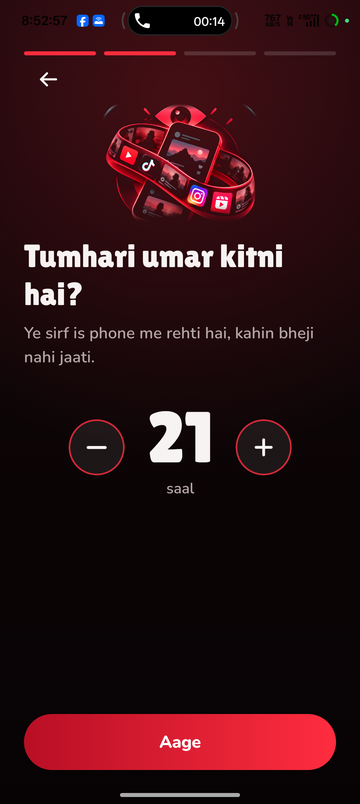
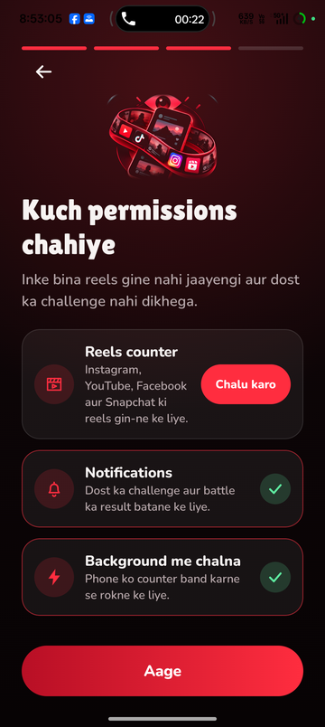
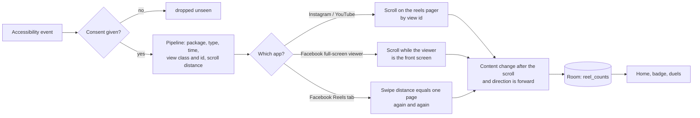
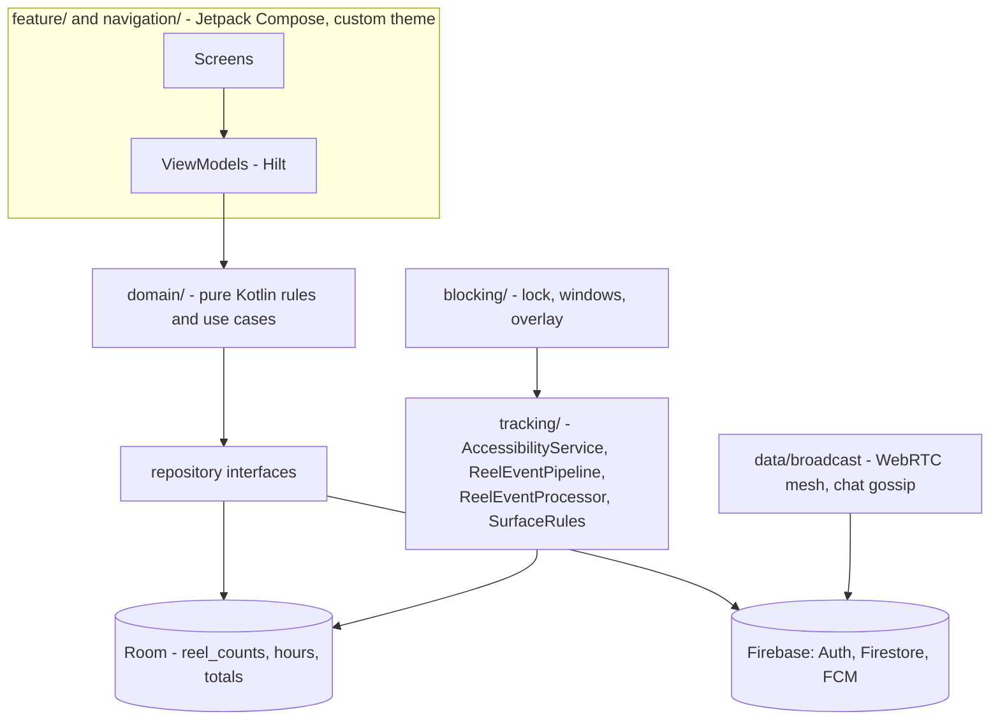

<div align="center">


### Kam scroll, zyada jeet.

**Friends challenge each other to watch fewer short videos. The lower reel count wins virtual coins, and a cartoon brain gets "fried" as the count climbs.**


<br/>

&nbsp;
&nbsp;
&nbsp;


</div>

---

## Table of contents

1. [What it is](#what-it-is)
2. [Features](#features)
3. [How reels are counted](#how-reels-are-counted)
4. [Privacy promises (hard rules)](#privacy-promises-hard-rules)
5. [Architecture](#architecture)
6. [Tech stack](#tech-stack)
7. [Project structure](#project-structure)
8. [Getting started](#getting-started)
9. [Firebase and the database](#firebase-and-the-database)
10. [Testing and guard scripts](#testing-and-guard-scripts)
11. [Release](#release)
12. [Status: what works, what is not verified](#status-what-works-what-is-not-verified)
13. [Documentation index](#documentation-index)
14. [Contributing](#contributing)
15. [Licences](#licences)

---

## What it is

DoomScroll is an Android app for Indian students and young adults (16 to 30) on mid-range phones. An Accessibility service counts how many
short videos (Reels, Shorts, Spotlight) you swipe through in **Instagram, YouTube, Facebook and Snapchat**. You set a daily limit, challenge
friends to a **duel**, and whoever watches **fewer** reels wins virtual coins. A 3D cartoon brain on the Home screen tells you how you are doing:

| Share of today's limit | Brain | Mood |
| --- | --- | --- |
| up to 40 % | Happy | *Dimaag fresh* |
| 41 to 99 % | Fried | getting bored, yawning, eyelids drooping |
| 100 % and over | Zombie | *Limit paar ho gayi* |

All copy is simple **Hinglish** (Hindi in English letters mixed with English). Every user-facing string lives in `res/values/strings.xml`.

## Features

**Counting and self-control**
- Live reel counter with an on-screen pill that shows today's count while a tracked app is open and goes away the moment you leave it
- Daily limit, streak (consecutive days under the limit), per-app breakdown
- Blocking engine: bedtime and focus windows, a lock when the limit is reached, friend-approved unlock requests (see `docs/blocking-engine.md`)
- Battery and autostart guide for Xiaomi, Realme, Oppo, Vivo and Samsung so the counter is not killed in the background

**Social**
- Google sign-in, usernames, a People list, invites with phone notifications
- Find friends from your contacts (only SHA-256 hashes of e-mail addresses leave the phone, never names, numbers or raw addresses)
- **Real duels** between friends: a challenge, an accept, a live scoreboard, and an automatic result when the time is up (no "show result" button)
- Five challenge modes written as pure Kotlin with unit tests: **1v1 Duel**, **Squad Battle**, **Night Pact**, **Forfeit Dare**, **Strict Lock** (`docs/challenge-modes.md`)

**Broadcast (voice rooms)**
- Anyone signed in can start a room or join any live room; invite people into yours; the host can remove someone
- Voice and chat travel phone to phone over WebRTC. **Chat is never stored on a server**
- Your profile circle pulses while you talk; a status line shows whether your voice is really leaving and arriving
- If the host closes the room, it closes for everyone

**First run**
- Animated splash in the colours of the icon, while the 3D brain loads behind it
- Four typed-out onboarding pages: **username, age, permissions, welcome**. Every letter that appears gives the phone a small vibration tick

**Money (virtual only)**
- Coins are virtual. They are never sold, never cashed out, never used for betting. A Pro subscription exists but never touches coins (`docs/coin-economy.md`, `docs/billing.md`)

## How reels are counted

A reel is **one swipe to the next video**. Going back to the previous one does not count.



| App | How a reel swipe is recognised | Status |
| --- | --- | --- |
| YouTube Shorts | view id `reel_recycler` | works on a real phone |
| Instagram Reels | view id `clips_viewer_view_pager` | works on a real phone |
| Facebook, Reels tab | Facebook hides its view ids, so the feed and the Reels tab look identical. A reels pager moves **one whole page per swipe**, so every swipe sums to the same distance (measured: 2120 px, within 0.1 %); the feed does not. A swipe is a reel when its total matches a recent one within 1.5 % | works on a real phone: forward counts, back does not, 8 feed swipes counted 0 |
| Facebook, full-screen viewer | the viewer is its own screen (`ImmersiveActivity`); scrolls count while it is in front | class name confirmed on a phone, real swipes inside it not yet tested |
| Snapchat Spotlight | no ids found yet | **not counted** until found on a real phone |

Ads inside Reels are counted like reels today (an open decision, see `CLAUDE.md`).

## Privacy promises (hard rules)

1. **Coins are virtual only.** No real money, no cash-out, no betting. Enforced by `scripts/check-coin-money-separation.sh`.
2. **The Accessibility service never reads what you watch.** Per event it may use: package name, event type, event time; for scrolls the view's class name, layout id and a signed scroll distance; for window changes the class name of the screen. It never touches text, descriptions, children, parents, usernames or captions. Enforced by `scripts/check-service-privacy.sh`, which must pass before every commit that touches `tracking/` or `blocking/`.
3. **Offline first.** Room is the source of truth for the UI; sync comes later.
4. **Production quality.** No placeholder TODOs.
5. **Analytics and crash reports carry no personal data** and stay **off** until the person says yes.
6. **The counter does nothing** until the person agreed to the in-app Accessibility disclosure.

## Architecture

MVVM with unidirectional data flow. Screens see only `*UiState`; repositories hide Room and Firebase.



Why it is easy to test: the counting rules (`ReelEventProcessor`), the five challenge modes, the coin ledger, the lock timer and the onboarding rules
are **pure Kotlin with no Android types**, covered by unit and property tests.

## Tech stack

| Area | Choice |
| --- | --- |
| Language / UI | Kotlin 2.0, Jetpack Compose with a **fully custom theme** (no Material look, no `material3`) |
| DI / async | Hilt, Coroutines and Flow |
| Local data | Room (schema exported to `app/schemas/`), DataStore, WorkManager |
| Backend | Firebase Auth (Google via Credential Manager), Cloud Firestore, FCM, Crashlytics (off until consent); Cloud Functions written, not deployed |
| Voice | WebRTC (`stream-webrtc-android`), STUN, optional TURN |
| 3D brain | Three.js (bundled in `assets/brain3d`) in a WebView, with a vector fallback |
| Billing | Google Play Billing, entitlement written only by server functions |
| Min / target SDK | 26 / 36 |
| Fonts | Lilita One, Nunito, Russo One (SIL OFL) |

## Project structure

```text
doomscroll-duel/
|-- app/src/main/kotlin/com/doomscrollduel/
|   |-- core/designsystem/   tokens, chunky components, BrainView, Brain3D, wordmark
|   |-- tracking/            AccessibilityService, event pipeline, reel processor, surface rules, health
|   |-- blocking/            lock, bedtime and focus windows, overlay, unlock via friends
|   |-- domain/              pure rules: challenge modes, coins, social, onboarding, analytics
|   |-- data/                Room, Firebase repositories, broadcast (WebRTC), duel tracker
|   |-- feature/             screens: home, auth, onboarding, splash, friends, duel, broadcast, settings ...
|   |-- navigation/          NavGraph, tab bar, deep links
|   `-- billing/ account/ analytics/
|-- app/src/main/assets/     surface_rules.json (per-app reel detection), brain3d/ (Three.js)
|-- app/src/test/            unit and property tests (pure Kotlin)
|-- app/src/androidTest/     Compose UI tests, reel counter and voice loopback tests (need a device)
|-- firebase/                firestore.rules and rules-test/ (emulator tests)
|-- functions/               Cloud Functions (TypeScript): unlock, purchases, coins, deletion, push
|-- docs/                    design notes, Play review pack, test plans, team setup
`-- scripts/                 guard scripts and store-asset helpers
```

## Getting started

**You need:** Android Studio (JDK 17 for Gradle), a phone or emulator with Android 8.0+, and for the rules tests JDK 21+ and Node 20+.

```bash
git clone https://github.com/nextdeveloperx/doomscroll-duel.git
cd doomscroll-duel
./gradlew :app:installDebug          # builds and installs the debug app (package com.doomscrollduel.debug)
```

Then, on the phone:

1. Open the app, sign in with Google and walk through the four onboarding pages.
2. Turn the **Reels counter** on in Android's Accessibility settings (after you agree to the in-app disclosure).
3. Scroll some reels and watch the Home screen count.

> **Google sign-in needs your debug key registered in Firebase**, otherwise it fails. The command is in [`docs/team-setup.md`](docs/team-setup.md).

Optional `local.properties` keys (never committed): `TURN_URLS`, `TURN_USERNAME`, `TURN_CREDENTIAL` for voice across strict phone networks.

## Firebase and the database

- Project: `brainpal-b3119` (shared with brainPAL). `app/google-services.json` is committed on purpose so a fresh clone talks to the same project.
- **Rules** are in `firebase/firestore.rules` and are deployed with `firebase deploy --only firestore:rules --project brainpal-b3119`. The app is written against these rules; an older rules file shows up as "permission denied" in the app.
- Collections: `directory`, `usernames`, `users/{uid}` (friends, inbox, sentInvites, broadcastInvites, fcmTokens), `duels/{id}/counts`, `emailIndex`, `broadcasts/{room}` (members, signals, kicked). Details in `docs/data-model.md`.
- Cloud Functions in `functions/` are written and unit-tested but **not deployed** (needs the Blaze plan). The app works without them; duel coin settlement is the part that waits for them.

## Testing and guard scripts

| What | Command |
| --- | --- |
| App unit and property tests | `./gradlew :app:testDebugUnitTest` |
| UI, reel counter and voice tests (device) | `./gradlew :app:installDebugAndroidTest`, then `adb shell am instrument -w -e class com.doomscrollduel.broadcast.VoiceMeshLoopbackTest com.doomscrollduel.debug.test/androidx.test.runner.AndroidJUnitRunner` |
| Firestore rules (emulator) | `cd firebase/rules-test && npm install && RULES=../firestore.rules npm test` |
| Server tests | `cd functions && npm install && npm test` |
| Reel-counter privacy | `scripts/check-service-privacy.sh` |
| Coins vs money | `scripts/check-coin-money-separation.sh` |
| Play readiness | `scripts/check-play-readiness.sh` (`--release` before upload) |

> Do not use `connectedDebugAndroidTest` on a phone you care about: it uninstalls the app and wipes the login. Use `installDebugAndroidTest` plus `adb shell am instrument`.

## Release

```bash
cp keystore.properties.example keystore.properties   # then point it at your upload key (kept outside git)
./gradlew :app:assembleRelease                        # signed APK
./gradlew :app:bundleRelease                          # signed AAB for Google Play (refuses to run unsigned)
```

R8 and resource shrinking are on. The version comes from `gradle.properties` (`VERSION_MAJOR.MINOR.PATCH` plus `VERSION_BUILD`); raise the build number for every upload.
The launch plan (assets, staged rollout, week-one routine) is in [`docs/launch-checklist.md`](docs/launch-checklist.md).

## Status: what works, what is not verified

**Verified on a real phone:** onboarding, splash, Home with the 3D brain, Google login, reel counting for YouTube, Instagram and the Facebook Reels tab (forward only),
the on-screen counter pill, a signed release APK that starts, Firestore rules on the emulator (62 checks) and a two-engine WebRTC loopback test (voice link + chat relay).

**Not verified:** voice audio between two real phones, a real duel across two accounts, the invite panel with several people, Google Play Billing, push notifications
when the app is closed, and anything in `functions/` (not deployed).

**Known gaps and open decisions:**
- Snapchat Spotlight is not counted yet (no view ids found); Instagram and YouTube ids are not marked verified in `surface_rules.json`
- Ads inside Reels are counted like reels
- Duel coins are not moved yet: wallets are server-only and need the Cloud Functions
- Voice needs a TURN relay on strict networks (set it up in `local.properties`); report and block screens for Broadcast are a Play-policy launch blocker
- Minimum age is 16 in the texts; 18 is safer under India's DPDP Act
- The working name, prices, Firebase region, support mailbox and grievance contact are still the owner's to decide

## Documentation index

| Topic | File |
| --- | --- |
| Rules for all five challenge modes | [`docs/challenge-modes.md`](docs/challenge-modes.md) |
| Blocking engine and its test plan | [`docs/blocking-engine.md`](docs/blocking-engine.md), [`docs/blocking-test-plan.md`](docs/blocking-test-plan.md) |
| Coins, Pro and billing | [`docs/coin-economy.md`](docs/coin-economy.md), [`docs/billing.md`](docs/billing.md), [`docs/billing-test-plan.md`](docs/billing-test-plan.md) |
| Data model and what leaves the phone | [`docs/data-model.md`](docs/data-model.md), [`docs/privacy-data-flow.md`](docs/privacy-data-flow.md) |
| Analytics events | [`docs/analytics-events.md`](docs/analytics-events.md) |
| Testing on real phones | [`docs/manual-test-checklist.md`](docs/manual-test-checklist.md), [`docs/device-test-matrix.md`](docs/device-test-matrix.md) |
| Closed beta and launch | [`docs/beta-plan.md`](docs/beta-plan.md), [`docs/launch-checklist.md`](docs/launch-checklist.md) |
| Google Play review pack (policies, forms, listing) | [`docs/play/`](docs/play/README.md) |
| New teammate setup | [`docs/team-setup.md`](docs/team-setup.md) |
| Project memory for Claude Code | [`CLAUDE.md`](CLAUDE.md) |

## Contributing

1. Read the [privacy promises](#privacy-promises-hard-rules) first. They are rules, not preferences.
2. Run `./gradlew :app:testDebugUnitTest` and the guard scripts before you push. Anything touching `tracking/` or `blocking/` must pass `scripts/check-service-privacy.sh`.
3. Keep user-facing text in `res/values/strings.xml`, in simple Hinglish.
4. If you change `firebase/firestore.rules`, add a case to `firebase/rules-test/rules.test.mjs` and deploy the rules together with the app change.
5. Never commit `keystore.properties`, `*.jks` or `local.properties`.

## Licences

- Fonts: Lilita One, Nunito and Russo One are under the SIL Open Font License 1.1 (see [`licenses/`](licenses/)). Feather icons are MIT.
- Three.js is MIT.
- The app's own source code does not have a licence file yet. Until the owner adds one, all rights are reserved.

<div align="center">
<sub>Made for people who want their brain back. <b>Kam scroll, zyada jeet.</b></sub>
</div>
